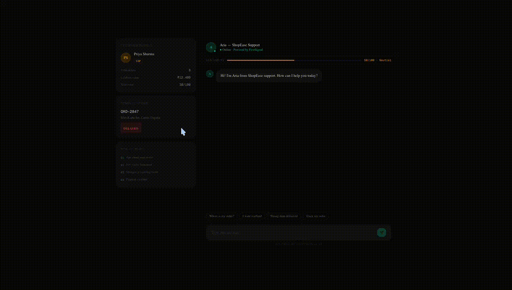

# FirstSignal — Autonomous Customer Intelligence Platform

> Detect customer frustration before it becomes churn.

An AI-powered customer intelligence platform that helps D2C brands identify at-risk customers, automate issue resolution, and proactively retain customers through memory, sentiment analysis, intelligent workflows, and voice escalation.

<p align="center">
  
  
  
  
  
  
  
</p>

## Try FirstSignal

**Live Demo:** https://first-signal-six.vercel.app

**Customer Chat:** https://first-signal-six.vercel.app/chat

**Mission Control Dashboard:** https://first-signal-six.vercel.app/dashboard

<p align="center">
  <a href="https://first-signal-six.vercel.app">
    
  </a>
</p>

---

## The Problem

Customer support teams are reactive by default.

By the time a customer reaches support, frustration has already built up, trust has declined, and churn may already be inevitable. Traditional chatbots answer questions — they do not understand customer history, monitor customer health, predict churn risk, or take proactive action.

Businesses need systems that detect problems before customers leave.

---

## The Solution

FirstSignal transforms customer care from reactive support into proactive customer retention.

The platform continuously evaluates conversations, retrieves historical context, assesses sentiment, predicts churn risk, and automatically initiates recovery workflows — before dissatisfaction becomes customer loss.

---

## Meet Aria

Aria is the customer intelligence agent powering First Signal.

She analyzes sentiment, retrieves customer history, initiates recovery workflows, and escalates critical situations through voice interactions when necessary.

---

## Multi-Agent Architecture

FirstSignal uses 6 specialized AI agents collaborating on every interaction:
```text

Customer Message
        ↓
┌─────────────────┐
│ Sentiment Agent │  Scores every message 0-100, detects frustration/churn risk
└────────┬────────┘
         ↓
┌─────────────────┐
│  Memory Agent   │  Retrieves full customer history across sessions via pgvector
└────────┬────────┘
         ↓
┌─────────────────┐
│ Retention Agent │  Evaluates churn probability, decides intervention
└────────┬────────┘
         ↓
┌──────────────────┐
│ Resolution Agent │ Executes refunds, discounts, redeliveries autonomously
└────────┬─────────┘
         ↓
┌──────────────────┐
│ Proactive Agent  │ Cron-based outreach before customers complain
└────────┬─────────┘
         ↓
┌─────────────────┐
│  Voice Agent    │ VAPI browser voice callbacks for critical escalations
└─────────────────┘
```
---

## How It Works

1. **Customer sends a message** → Chat API receives it
2. **Sentiment Agent scores it** (0-100) → Detects frustration, churn risk, buying intent
3. **Memory Agent retrieves context** → Past complaints, order history, sentiment patterns from pgvector
4. **Groq LLaMA generates response** → Enriched with full customer context
5. **Retention Agent detects intent** → Identifies if refund, discount, or escalation needed
6. **Resolution Agent executes action** → Real database action fired autonomously
7. **Proactive Agent monitors** → Cron job checks for at-risk customers every cycle
8. **Voice Agent escalates** → VAPI browser call initiated for critical cases
9. **Dashboard updates live** → Mission Control reflects all changes in real time

---

## Core Features

### Real-Time Sentiment Intelligence
Every message scored 0-100. Frustration, churn risk, and buying intent detected instantly. System behavior changes dynamically based on score thresholds.

### Persistent Cross-Session Memory
Customers remembered across separate sessions using pgvector embeddings — past complaints, order history, sentiment patterns, resolution outcomes.

### Autonomous Resolution Engine
The platform executes real actions:
- Refund processing with unique refund IDs
- Discount code generation and application
- Express redelivery scheduling
- Human escalation with AI-generated briefings

### Proactive Customer Recovery
Cron-triggered outreach identifies delayed orders and at-risk customers before they complain. Aria initiates the conversation — not the customer.

### Voice Escalation
For critical interactions, Aria initiates live voice calls directly from the browser via VAPI. Call transcripts saved back to customer memory.

### Mission Control Dashboard
- Live conversation feed with real-time sentiment scores
- Customer health score rings (calculated from sentiment + order history + escalations)
- AI-generated business insights from live data
- Escalation alerts and autonomous action logs
- Voice callback panel

---

## Example Customer Journey

**Customer:** *"I've been waiting 6 days for my order. This is ridiculous."*

| Step | Agent | Action |
|------|-------|--------|
| 1 | Sentiment Agent | Score: 20/100 — CRITICAL, churn risk: HIGH |
| 2 | Memory Agent | Retrieves: previous delivery complaint, VIP status |
| 3 | Retention Agent | Flags: immediate intervention required |
| 4 | Resolution Agent | Applies 15% discount, generates REF-1780042847773 |
| 5 | Voice Agent | Initiates browser voice callback |
| 6 | Dashboard | Updates live — Issue resolved autonomously, no human intervention required |

---

## Business Impact

- Reduce support workload through autonomous resolution
- Detect churn signals before customers leave
- Increase retention through proactive outreach
- Improve CSAT through memory-powered interactions
- Escalate only the highest-risk conversations to humans

---

## Tech Stack

| Layer | Technology |
|-------|-----------|
| Frontend | Next.js 14, TypeScript, Tailwind CSS |
| Database | Supabase (PostgreSQL + pgvector) |
| AI Model | Groq LLaMA-3.3-70B |
| Memory | pgvector embeddings |
| Voice | VAPI Web SDK |
| Deployment | Vercel |

---

## Project Structure
```text
firstsignal/
├── app/
│   ├── page.tsx              # Landing page with live animated demo
│   ├── chat/page.tsx         # Customer chat interface
│   ├── dashboard/page.tsx    # Operator Mission Control
│   └── api/
│       ├── chat/             # Main AI conversation endpoint
│       ├── dashboard/        # Analytics + metrics API
│       ├── escalation/       # AI summary generation
│       ├── outreach/         # Proactive outreach trigger
│       ├── conversation/     # Full conversation retrieval
│       └── vapi/             # Voice callback endpoints
├── components/
│   ├── chat/                 # Chat widget components
│   └── VoiceDemo.tsx         # VAPI voice integration
└── lib/
├── agents/               # Multi-agent architecture exports
├── sentiment.ts          # Sentiment Agent
├── memory.ts             # Memory Agent
├── action-detector.ts    # Retention Agent
├── resolution.ts         # Resolution Agent
└── proactive-outreach.ts # Proactive Agent
```
---

## Setup

```bash
git clone https://github.com/uttampreet-dev/FirstSignal.git
cd firstsignal
npm install
cp .env.example .env.local
# Add your API keys to .env.local
npm run dev
```

### Environment Variables

```env
NEXT_PUBLIC_SUPABASE_URL=
NEXT_PUBLIC_SUPABASE_ANON_KEY=
SUPABASE_SERVICE_ROLE_KEY=
GROQ_API_KEY=
NEXT_PUBLIC_VAPI_PUBLIC_KEY=
NEXT_PUBLIC_VAPI_ASSISTANT_ID=
CRON_SECRET=
```

---

## Evaluation Criteria Alignment

| Criteria | How First Signal Addresses It |
|-----------|------------------------------|
| **Innovation & Novelty (30%)** | Combines customer memory, sentiment intelligence, proactive outreach, autonomous resolution workflows, and AI voice escalation into a unified customer care platform. |
| **Real-World Applicability (25%)** | Designed specifically for D2C businesses facing customer churn, delayed deliveries, refund requests, and customer retention challenges. |
| **Technical Architecture (25%)** | Built using modular AI services, vector memory (pgvector), workflow automation, function calling, voice integration, and real-time dashboard analytics. |
| **Documentation Clarity (20%)** | Includes architecture documentation, setup instructions, deployment guide, source code organization, and live demonstrations. |
---

## Why First Signal Is Different

Traditional customer support bots answer questions.

First Signal focuses on customer retention.

Instead of reacting after a customer becomes dissatisfied, the platform identifies early warning signals, retrieves historical context, predicts churn risk, and initiates recovery actions before customer relationships break down.

## How FirstSignal Compares

| Feature | Traditional Chatbot | FirstSignal |
|---------|-------------------|-------------|
| Remembers past conversations | ❌ | ✅ Cross-session memory |
| Detects frustration | ❌ | ✅ Real-time scoring |
| Proactive outreach | ❌ | ✅ Cron-triggered |
| Processes refunds | ❌ | ✅ Autonomous execution |
| Voice escalation | ❌ | ✅ Browser-based VAPI |
| Customer health scores | ❌ | ✅ Calculated in real time |
| AI-generated insights | ❌ | ✅ From live data |
| Human time required | High | Zero for most cases |

---

## Future Enhancements

- WhatsApp & SMS channel integration
- CRM integrations (Shopify, WooCommerce)
- Multi-language support (Hindi, regional languages)
- Advanced churn prediction ML model
- Multi-brand support
- Customer segmentation engine

---

*Built with Next.js · Supabase · Groq · VAPI · Tailwind CSS*
