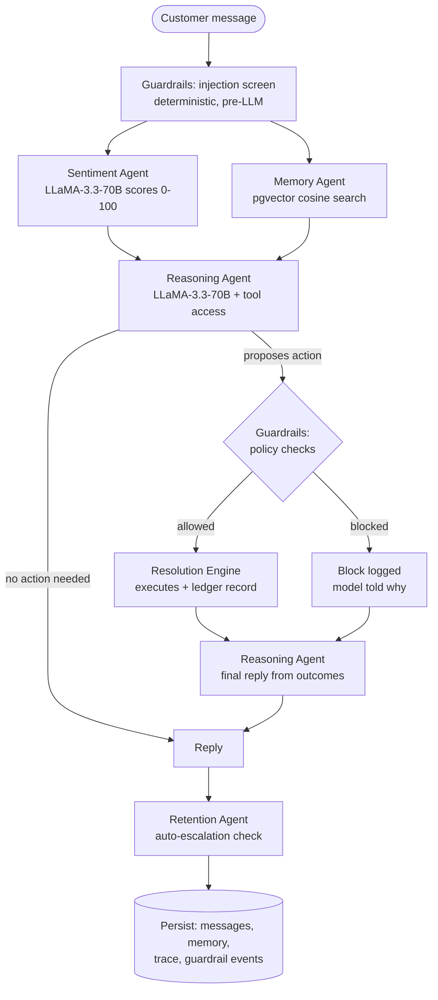

# FirstSignal — Architecture

FirstSignal is an autonomous customer-intelligence pipeline. Every customer message flows through an orchestrated sequence of specialized agents, each of which records what it saw, what it decided, and how long it took. The full decision trace is persisted and visible both in the chat UI ("AI reasoning") and on the Mission Control dashboard.

## The pipeline

Sentiment analysis and memory retrieval run **in parallel**; reply generation and the tool-execution round-trip are the only serial LLM steps.

**Everything streams.** The chat endpoint emits Server-Sent Events while the pipeline runs: each agent's decision appears in the UI the moment it happens, and reply tokens stream in as the model generates them. The customer isn't watching a spinner — they're watching the system think.

## Components

| Module | Role | Model calls |
|---|---|---|
| `lib/orchestrator.ts` | Coordinates the pipeline, records the per-step decision trace | — |
| `lib/sentiment.ts` | Scores every message 0–100, flags churn risk & buying intent | 1 |
| `lib/embeddings.ts` | all-MiniLM-L6-v2 (384-dim) running in-process via ONNX — zero API cost | local |
| `lib/memory.ts` | Saves significant turns with embeddings; retrieves by pgvector cosine similarity | local |
| `lib/tools.ts` | Function-calling schemas — valid order IDs are injected as an enum so the model cannot hallucinate order numbers | — |
| `lib/guardrails.ts` | Deterministic policy layer: injection screen + 6 action rules; logs every verdict | — |
| `lib/resolution.ts` | Executes approved actions against the DB; writes the compensation ledger | — |
| `lib/health.ts` | Churn early-warning: EWMA sentiment trajectory + order/escalation/loyalty factors | — |
| `lib/proactive-outreach.ts` | Cron-triggered outreach for delayed/overdue orders, deduped per order | — |
| `components/VoiceDemo.tsx` | VAPI Web SDK browser voice escalation; transcript saved back to memory | — |

## Tool calling (not keyword matching)

The reasoning agent has four tools: `process_refund`, `apply_discount`, `mark_redelivery`, `escalate_to_human`. The LLM decides when to call them and with what arguments. Two design constraints:

1. **Schema-constrained arguments** — the customer's real order numbers are injected into the tool schema as an `enum`, so the model can only reference orders that exist and belong to this customer.
2. **Propose, don't execute** — a tool call is a *proposal*. The guardrails engine validates it; the model receives the outcome (success or block reason) as a tool result and composes the final reply around what actually happened.

## Guardrails

Deterministic checks between the model and the database — the model can never act outside them:

| Rule | Policy |
|---|---|
| Injection screen | Pattern match on the raw message before any LLM call; a hit disables tool access for the turn and logs the attempt |
| Order ownership | Refund/redelivery order must belong to the requesting customer |
| Refund cap | Autonomous refunds ≤ ₹10,000; larger amounts require a human |
| One compensation per order | The `resolution_actions` ledger is checked before every compensation |
| Discount bounds + cooldown | 5–15% only, max one goodwill discount per customer per 30 days |
| Rate limit | Max 3 autonomous actions per conversation, then auto-escalate |

Every verdict — allowed or blocked — is written to `guardrail_events` and shown live on the dashboard's Guardrails tab.

## Memory

Significant turns (negative sentiment, churn risk, executed actions, concrete issues) are embedded with **all-MiniLM-L6-v2** — a 384-dim sentence transformer running in-process via ONNX, so there is no embedding API dependency or per-query cost — and stored in Postgres with **pgvector**. Retrieval is cosine similarity against the *current message* (`match_memories` RPC, HNSW index), so the agent recalls what's relevant, not just what's recent. If the model or RPC is unavailable the system degrades to recency retrieval rather than failing.

## Churn health trajectory

`health = clamp( EWMA(per-message sentiment, α=0.3) + loyalty + spend − escalations − order trouble )`

The EWMA runs over the customer's full per-message sentiment history (`messages.sentiment_score`), and the trend (improving / stable / declining) compares the recent window against the prior one. This is a trajectory, not a snapshot — a customer whose scores read 70→55→40→30 is flagged *declining* long before a single-message system would react.

## Data model

Core tables: `customers`, `orders`, `conversations`, `messages` (+ per-message `sentiment_score`), `memory_embeddings` (+ 384-dim `embedding`).
Observability tables: `agent_traces` (per-message pipeline trace), `guardrail_events` (every verdict), `resolution_actions` (compensation ledger enforcing limits).

Migration: `supabase/migrations/20260716_intelligence_upgrade.sql` (idempotent). Verify with `npm run check:db`.

## Verification

- `npm run verify` — **no API keys required**: typecheck, the full injection-screen suite, the deterministic guardrail policy rules, and a production build.
- `npm run check:db` — confirms pgvector, the `match_memories` RPC, and the observability tables are live.
- `npm run eval` — 54 labeled checks against the production prompts and model (needs `GROQ_API_KEY`).

## Failure modes & degradation

| Failure | Behavior |
|---|---|
| Embedding model unavailable | Memory falls back to recency retrieval; flagged in the trace |
| `match_memories` RPC missing | Same recency fallback, error logged once |
| Observability tables missing | Chat still works; trace/guardrail persistence skipped with logged warnings |
| Sentiment JSON malformed | Neutral default (50) so the conversation never breaks |
| Tool arguments malformed | Call skipped; model replies without action |
| Groq rate limit in evals | Exponential backoff retry |

## Why these choices

- **Groq + LLaMA-3.3-70B** — sub-second latency matters more in support chat than frontier-model reasoning; tool-calling support is solid.
- **Local ONNX embeddings over an embedding API** — no extra key, no per-query cost, no network hop on the hot path after warm-up; MiniLM is more than adequate for support-conversation recall.
- **Deterministic guardrails over "LLM judges LLM"** — policy must be auditable and non-bypassable. A regex/ledger check cannot be sweet-talked.
- **Supabase** — pgvector, realtime dashboard subscriptions, and row storage in one system.
